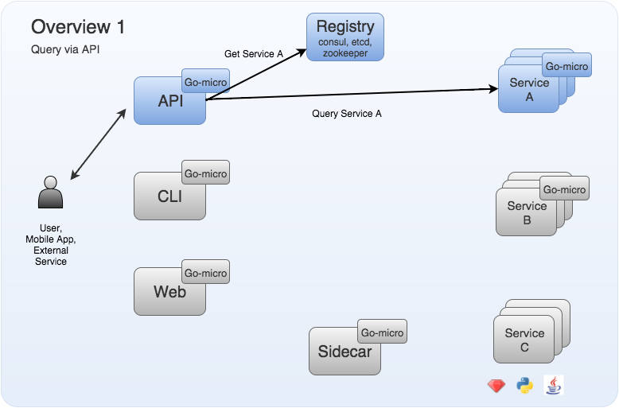
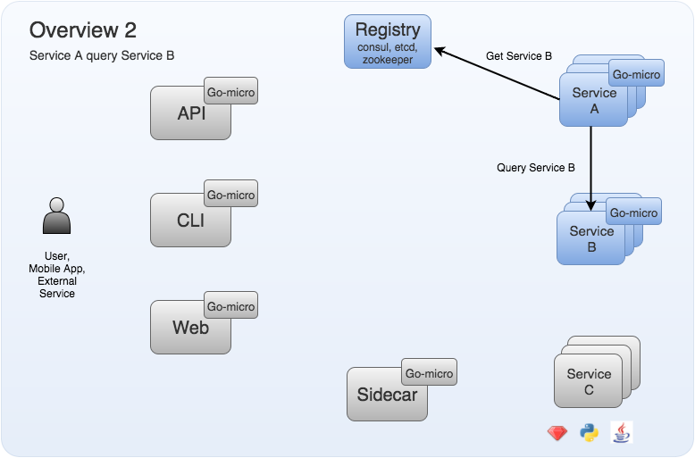

# Architecture

This section should explain more about how micro is constructed, how the various libraries/repos relate to each other 
and how they should be used.

## Overview

-

-

-

## Micro

### CLI

### API

### Web UI

### Sidecar

## Go Micro

### Registry

### Selector

### Broker

### Transport

### Client

### Server

## Go Platform

### Auth

### Config

### DB

### Discovery

### KV

### Log

### Monitor

### Metrics

### Router

### Trace

## Go Plugins

## Code Generation
