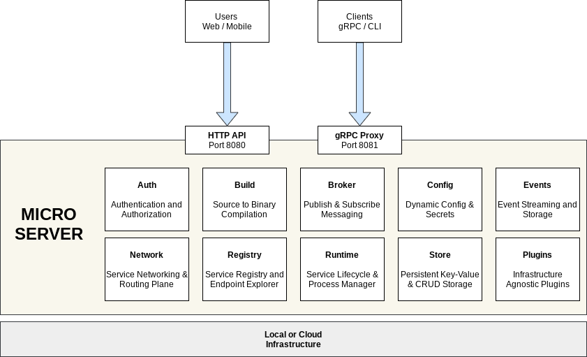

## Architecture
{: .no_toc }

This document covers the architecture of micro, design decisions and tradeoffs made.

## Contents

* TOC
{:toc}

## Overview

Micro is a platform for cloud native development. It takes the concept of distributed systems and codifies it as a software 
design pattern using microservices and related primitives. The overall goal of Micro is to abstract away cloud infrastructure 
and to define a set of building blocks which can be used to write cloud services aka microservices, APIs or distributed systems.

## Rationale

Micro was born out of a pain with existing development models in the cloud. The majority of time has been spent coming to grips 
with complex cloud native infrastructure as opposed to software design. Cloud is in its infance, predominantly focused on 
computing and infrastructure services. Development has largely lagged behind and there has been no vertically integrated 
solution to make sense of it all.

PaaS in prior generations like Heroku provided a full solution for web application development using Rails as the developer angle. 
As they and others iterated though, multi-language became an attractive solution and one that really muted its opinionated approach 
and diluted the overall focus of developer productivity.

Our focus is developer productivity and we see that as one achieved through constraints. Every dominant platform constrained itself 
to a specific model and then software exploded to leverage it. We think Cloud is much like Mobile in the sense that it requires 
an iPhone or Android like approach to managing its complexity. Cloud needs a development model, it needs an operating system and 
we think Micro can provide that through a completely vertically integrated solution.

Micro is Android for Cloud. PaaS 3.0. Or better known as a cloud operating system. As a framework Rails went far but it was incomplete 
without the likes of Heroku to host it. Spring fell short as well and was acquired by VMWare to try make sense of this platform model. 
We think Micro needs to take inspiration from Android, to encapsulate all the concerns of cloud, abstract away the hardware and 
define a sofware lifecycle, development and consumption model for it.

## Design

Micro is designed as 3 core components:

- Server - A single server which acts as the runtime for a cloud platform
- Clients - Entrypoints via command line, api gateway and gRPC proxy/sdks
- Framework - A Go framework specifically designed for writing microservices

Micro services are defined as:

- Domain Driven - APIs are written in protobuf format and act as the API contract for the service
- Engineered by Design - Written using the micro service framework so that they employ a standard model
- Reusable building blocks - Each service acts as a building block for the next. In this model, everything is a service

For in-depth material see the [Reference](/reference). This doc will otherwise cover things at a high level.

**Server Architecture**

Below is the architecture of the Micro Server which is composed of a number of independent services. Micro itself 
is accessed through a HTTP or gRPC API. Micro is runtime agnostic and provides plugin for running on many 
different architectures whether its local, kubernetes or beyond.

**Service Architecture**

A Micro service makes use of a Go Service Framework which provides Go interfaces for accessing the services provided 
by the Micro Server. It also initialises your server to run on the underlying runtime and exposes your services 
via a gRPC server. Micro makes is so all you have to think about is the business logic. 

## Server

The server acts as an abstraction for the underlying infrastructure. It provides distributed systems primitives as building 
blocks for writing microservices. We'll outline those below. The rationale behind defining a single server is based on 
the understanding that all systems at scale inevitably need a platform with common building blocks. In the beginning this 
supports monolithic apps for building CRUD and over time evolves to firstly separate the frontend from backend and then 
starts to provide scalable systems for persistence, events, config, auth, etc.

The server encapsulates all these concerns while embracing the distributed systems model and running each core concern 
as a separate service and process. Its the unix philosophy done well for software composition. As a whole though 
micro is a single monolithic codebase after many separate libraries were consolidated and inevitably go-micro got 
folded into micro itself.

## Clients

Clients are effectively entrypoints or forms of access for the Micro server. The server runs both an API gateway and gRPC proxy. 
The API is deemed as a public facing http api gateway that converts http/json with path based routing to rpc requests. The 
world still built around http and cloud services emerging with that pattern, it feels like this is the right approach.

The gRPC proxy is a forward looking entrypoint, where we see it as a way of extending the service-to-service communication 
to the developers laptop or other environments. At the moment it acts as a proxy for command line to remote environments.

The command line interface itself is deemed as a client and the defacto way to interact with Micro. We do not offer a web UI. 
The assumption is web is a context switch and we'd prefer developers to stay in the terminal. The CLI is extensible in the 
sense that every service you run becomes a subcommand. By doing so we take the API path based model and service decomposition 
to the CLI as well.

The final piece that is a continuous work in progress is gRPC generated clients which can be found in micro/client/sdk. 
Eventually they will be published to various package managers but for now are all routed in one directory. These are built from 
the protos defined for each core service within Micro, enabling multi-language access. We do not assume services to be built 
multi-language but consumption of Micro and services may extend outward.

## Framework

The Go service framework is a core piece which comes from the original go-micro framework started in 2015. This framework offered 
core distributed systems primitives as Go interfaces and made them pluggable. With its complexity and overlap with Micro we 
decided the best thing was to merge the two and create a Service Framework within Micro to define the defacto standard for building 
Micro Services in Go. The framework provides pluggable abstractions with pre-initialised defaults. The developer 
will import and use any of the packageswithin the framework without any initialisation, they in turn speak to the micro server 
or basically the core services via gRPC. 

For the developer, this is their main point of interaction when writing code. We employ a build, run, manage philosophy where 
build actually starts with putting something in the hands of the developer. Import the framework, start writing code, 
import various packages as needed when you have to get config, check auth, store key-value data. Then run your service using 
Micro itself. The server abstracts away the infra, the service is built to run on Micro and everything else is taken care of.

## Services

The services provided by the server are below. These are identified as the core concerns for a platform and distributed systems 
development. In time this may evolve to include synchronization (locking & leadership election), sagas pattern, etc but for 
now we want to provide just the core primitives.

- **API** - HTTP Gateway which dynamically maps http/json requests to RPC using path based resolution
- **Auth** - Authentication and authorization out of the box using jwt tokens and rule based access control.
- **Broker** - Ephemeral pubsub messaging for asynchronous communication and distributing notifications
- **Config** - Dynamic configuration and secrets management for service level config without the need to restart
- **Events** - Event streaming with ordered messaging, replay from offsets and persistent storage
- **Network** - Inter-service networking, isolation and routing plane for all internal request traffic
- **Proxy** - gRPC identity aware proxy used for remote access and any external grpc request traffic
- **Runtime** - Service lifecyle and process management with support for source to running auto build
- **Registry** - Centralised service discovery and API endpoint explorer with feature rich metadata
- **Store** - Key-Value storage with TTL expiry and persistent crud to keep microservices stateless

The assumptions made are by building as independent services we can scope the concerns and domain boundaries appropriately but 
cohesively build a whole system that acts as a platform or a cloud operating system. Much like Android for Mobile we think 
Micro could become a definitive server for the Cloud.

## Environments

Environments are a concept introduced in v3 which allow you to switch between entirely different deployments of Micro. 
The term 'environment' basically implies what we already understand as separate development or runtime 
environments whether it be local, staging, production or something by another name. You can think of it as a deployment of 
Micro targeted by the micro proxy which runs within every server.

Environments as a built in concept allow us to create a workflow that let's us seamlessly switch between them using a single tool. 
In kubernetes this is known as contexts, in Micro we understand these as entirely separate running environments for our software. 
To us it just makes sense to build it in. An environment might be a deployment in AWS on managed k8s or multiple separate regional 
deployments identified be [name]-[region] or similar.

Environments are homed by the micro proxy for remote access. By default locally this runs on :8081 and you simply do `micro env set local` 
to have all commands run against it. The CLI proxies all commands to the micro proxy and in turn that send the request to the relevant 
services hosted by the Micro server.

Micro bakes in 3 environments by default; local, dev (free cloud hosted), platform (paid cloud hosted). The goal is to move 
beyond open source into something that seamless integrates the cloud for all developers everywhere.

## Namespaces

Namespaces in Micro are a form of resource isolation and multi-tenancy. Most people know namespacing from linux lxc or kubernetes. 
This overlaps but also evolves from how micro previously used it. Micro used to use logical namespacing through names prefixed 
with a namespace. This allowed multiple tenants to exist in a single environment and using explicit naming to identify them. 

As we're starting to see Micro as more of a platform and cloud operating system there was a need to codify this concept across 
all resources. Namespacing is incorporated across every service so that your services are isolated in the registry and network, 
so that your data is isolated in their specific databases and tables and so authentication and accounts are tied to individual 
namespaces.

Namespaces encapsulate accounts, resources and networking routing. Namespaces beyond this are also useful for feature and branch 
development. It enables subsets of services to be deployed into an isolated namespace for testing. This enables a single 
environment for development to be used in a real world context and for production to enable feature flagging where needed.

## Glossary

- Server - the micro server which encapsulates infrastructure and distributed systems concerns
- Clients - entrypoints for accessing the server and services run by Micro
- Framework - the Go service framework used to write Micro services
- Environment - an instance of the micro service running locally or in a remote environment
- Namespaces - isolated grouping of resources and multi-tenancy as a concept across Micro
