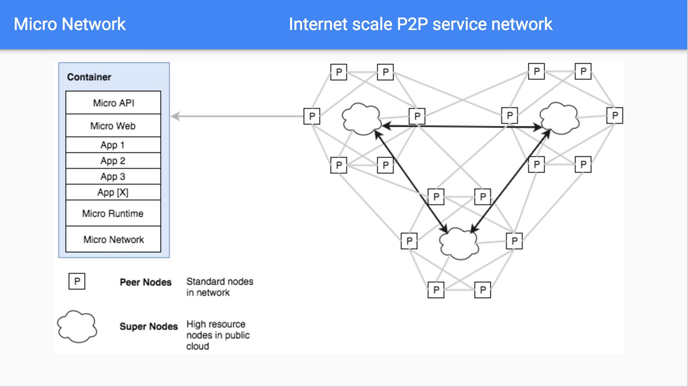
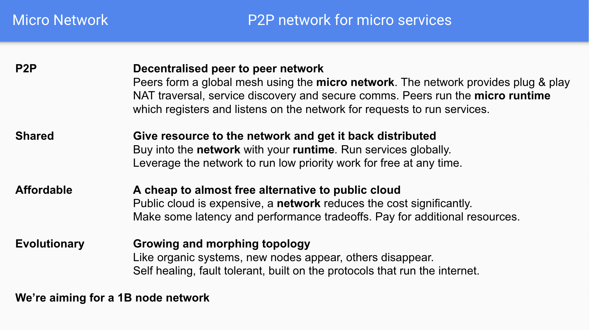
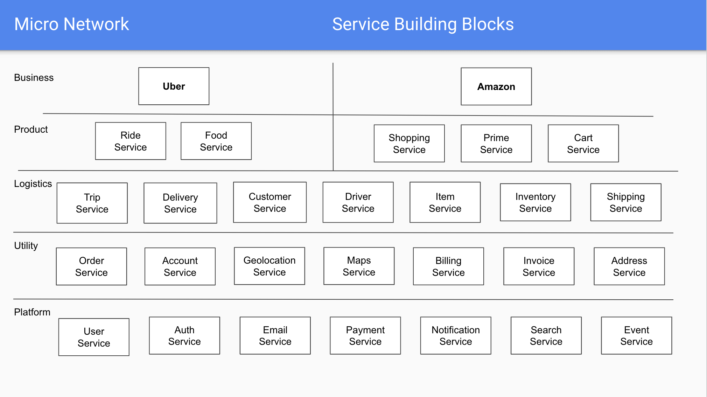

# Network

The micro network is an **open  network for micro services**.

## Overview

The power of collaborative development has mostly been restricted to trusted environments within organisations. 
These platforms unlock incredible productivity and compounding value with every new service added. They provide 
an always-on runtime and known developer workflow for engineers to collaborate on. This has largely been 
difficult to achieve outside of organisations.

The micro network looks to solve this problem using a shared global network for micro services.

## Contents

- [Architecture](#architecture)
  * [Features](#features)
  * [Services](#services)
  * [Identity](#identity)
  * [Evolution](#evolution)
  * [Runtime](#runtime)
  * [Governance](#governance)
  * [Network](#network)
  * [Collaboration](#collaboration)
  * [Value Exchange](#value-exchange)
- [Economics](#economics)
- [Glossary](#glossary-of-terms)

## Architecture

The network is a globally distributed network based on existing open source technology developed by micro and others. 
It provides the core requirements for collaborative service development at scale. This includes a common 
communication protocol, service discovery system, secure governance, service runtime and resource exchange model.

### High Level

At the high level we're using the open source micro toolkit as the foundation for an overlay network on the internet and a platform for microservices. 
Each user runs a local node which provides access to the network, a runtime for running services, a local http api gateway and web browser.

In future this design will include automatic data synchronization and backup for long term storage.

### Features

The network features a p2p compute runtime with a high bandwidth backbone. The network itself provides discovery, governance and a runtime. 
The design is such that whatever resource you put in, you get back distributed across the network. It's global and shared by default. You can 
buy more resource using tokens but you'll also get tokens for any requests made to your services.

The network is evolutionary and our goal is to reach 1B nodes with over 10x more services running on the network itself. 

### Services

The network provides a micro service runtime. Each service can be used as a building block for the next. 
This layering allows the creation of unique services on a foundation of hundreds of others. This is the microservice 
architecture pattern used by Google, Netflix, Uber and others which we're bringing to the masses.

Developers contribute services to the network and build on each others work.

### Identity

Most networks being bootstrapped require some form of identity system. Many of these start with base level asymmetric cryptography 
using public/private key pairs. While we'll look to use these we believe this system is not enough. Anyone can participate in the 
network and anyone can generate a public/private key pair. Bad actors will likely cycle these and DDOS the network.

What we propose is a two layer identity system, with layer 1 as the public/private key pair (potentially using SPIFFE) and layer 2 
as a reputation based scoring system which over time solidifies your reputation and trusted identity in the network. The longer 
you exist in the network and participate the more likely it is we can identify you as a trusted party. New participants will be 
provided some base level access but must either pay to participate or stay on the network long enough to get further access.

The identity system will likely be as follows

- Layer 0 - the node connected to the network
- Layer 1 - the app providing a service to the network
- Layer 2 - the reputation scoring based on node + service

### Evolution

No system in nature is static and so we should not expect any technical infrastructure or software to remain static. We believe 
evolutionary software is far superior to anything else and this in principle needs to be promoted by the underlying runtime 
on which it runs. The micro network will be an evolutionary system which requires all services run on it to also behave in such 
a manner.

Software will be downloaded from its public source form. It will then be built and run, all within the same location. Updates to 
the source will result in periodic generation of new versions of a running service. Previous instantiations will remain for 
their lifetime or until they die for any unexpectected reason. This is evolution and we believe evolution is the most powerful 
method for software delivery.

### Runtime

While our primary focus is to provide a globally distributed network for micro services this can't be fully realised without a 
method of deploying software. It's important that in the context of creating evolutionary systems we provide a runtime which 
supports this method of development. The micro runtime is a process management system tightly coupled to the network itself 
with the ability to run applications from source code.

Developers no longer need be concerned with packaging and shipping their code. If it exists in a public repository it can be 
deployed to the micro network. We will primarily look to support Git via GitHub as the source of truth. This allows anyone 
to run a copy of whatever already exists in the network but it also creates a level of trust around completely **Open Source Services**.

Beyond this, our expectation is to standardise on wasm (web assembly) which lets us provide a universal runtime for any 
language which supports wasm compilation. We'll likely provide rudimentary language detection early on to auto-compile wasm 
binaries. Eliminating another intermediate step for developers to ship software.

### Governance

While we can provide an evolutionary network and a runtime which supports such a system, it is very unlikely that such a system 
can be sustained standalone. Platforms are managed by operators and every system in nature has some form of governance. The 
micro network will be no different.

Having learned from years of managing platforms it is abundantly clear that we do not want human involvement to manage something 
on the order of 1B nodes. With likely 10x more services. Even if the task of management is distributed to node owners (which 
defeats the purpose of our goals) it would be impossible to perform such coordination at scale. Because of this the system 
we develop will have to be self governing.

The micro network will include self governance driven through automation. No humans will be involved in commanding the placement 
of services or have the ability to shut them down. The governance mechanism for all services and the network itself will be in code, 
it will be a service running on the network itself. It will also be an open source service anyone can see the code for and 
contribute to.

Like any other service, this system will be evolutionary.

### Network

In the case of micro, the "network" is an overloaded term both referring to the underlying system made up of nodes or peers which 
provide compute and also the overlaying communication system used for services to discover and communicate with each other.

In this case we'll speak to the service layer network. The micro network provided to developers consists of four pieces; 
registry, transport, broker and client/server. These components can be found in [Go Micro](https://github.com/micro/go-micro) 
for more info.

The registry provides a service discovery mechanism for applications in the network. Think of this as DNS but in a way that's 
self describing and built for transient systems. Our assumption is that developers should not have to leave the network 
to understand what a service is built for and that any number of prototypes with high percentage failure rates will exist on the 
network itself. Because of this we need a system that describes services in their entirety and expiration of dead nodes to 
prevent various failure modes.

The transport provides a common synchronous communication system. Ideally this is abstracted away so the developer does not 
have to worry about what the protocol is. In our mind most frameworks and libraries provide rich http support with prominent 
ecosystems. We want to enable this while providing a highly efficient binary protocol beneath the covers. 

The broker is an asynchronous communication system. It allows for publishing messages to an unknown number of interested parties. 
In some cases there may be no subscribers in which case we need to account for future interest and potential short term storage 
and access. It is critical that event based programming be a core tenant of the network. This likely also promotes a functional 
programming model which will be native to the network.

The client/server abstracts away the registry, transport and broker so that from a development standpoint all that remains is a 
focus on the domain itself. Ideally inter-service communication should be thought more as high level domain driven design and 
later on flow based programming.

The network encapsulates low level details of distributed system communication and allows the developer to focus on whats important.

### Collaboration

It is not enough to provide an environment for running applications. Many platforms already exist for this function. Individuals 
can use cloud hosting to do this. Networks are being built to run decentralized applications (dApps). This is all good and well 
but at the base level is just compute, access to resource.

What's more useful is a focus on **collaboration**. Organizations create a single cloud hosting account as a trusted environment 
for their engineers and teams to build software together which then becomes a unified product offering. They do not have to worry 
about whether or not they can trust other teams or engineers using it. They do not have to worry about services disappearing or 
even building everything from the ground up. Teams working independently produce services which can be accessed by others teams. This 
becomes the basis for new applications, the foundation which they no longer have to rebuild. The velocity of their development 
increases with every new service added. New products can be built at rapid pace, and the compounding value of this in the long 
term has been demonstrated by Amazon, Facebook, Google, Uber, and many more.

Collaboration is the key. This must be our focus and is our focus. Because we focus on microservice development. We provide 
the building blocks in a network and push forward the idea of collaborative software development so that we as individuals 
can collectively build towards what does not exist outside of organizations. This is an opportunity to build something at 
the scale of Google and others in a coordinated effort without any central intermediary or the need to work at a company.

Collaboration will be our central focus, not compute, not storage, nor singular applications, but instead multi application 
services built collectively by the network. 

### Value Exchange

What do we mean by value exchange? It is not enough to provide an environment for collaborative development. We need some way of 
rewarding those who are participants in the network and provide resources or services to the network itself.

Value exchange is basically the idea of exchanging some *thing* in return for some *value*. In our case we will exchange **resources** 
for the use of the network **runtime** or **services**. Resources can either be compute offered to the network via the runtime, 
the ability to actually run services, or some form of monetary payment. Resources will be given a quantified value in the network 
and abstracted away into a native exchange method using an api **token**.

Api tokens will behave as a utility token, they will have a lifetime and it will be possible to generate them if a user participates 
in the network or makes monetary payment to acquire them. It will be possible to refresh expired tokens.

Our expectation is that the token becomes the native exchange method for resource in the micro network but the value of a token 
will be self adjusting based on the size of the network. The value of the network is based on the number of participants, resources 
and services, not the token itself.

## Economics

Building such an architecture is good in theory but in practice requires network effects to drive its use, growth and ability to thrive. 
It is not enough to create an open network and ask developers to run peers in the network or contribute, there has to be some economic 
incentive to be part of it.

This is where [Token Economics](https://en.wikipedia.org/wiki/Token_economy) plays a role. Those contributing resources to the scale 
of the network and/or services on the network should be rewarded accordingly. Our goal is to build a native tokenized transaction 
system into the network to provide this resource usage model via exchange of tokens for services.

Here's a good explanation of [Token Economics](https://www.investinblockchain.com/token-economics/).

## Glossary of Terms

- **Network** - is the entire system for communication and coordination
- **Backbone** - is the core public high bandwidth main network itself
- **Super Node** - is a host which runs the *backbone* of the network
- **Peer Node** - is a host which runs *services* in the network
- **Service** - is a process which runs in the network and provides some utility
- **Token** - is an economic incentive used in exchange for the use of a service

## Release

Coming soon

## Contribute

Join the [slack](https://micro.mu/slack/) or [reddit](https://www.reddit.com/r/micronet/) community to discuss
