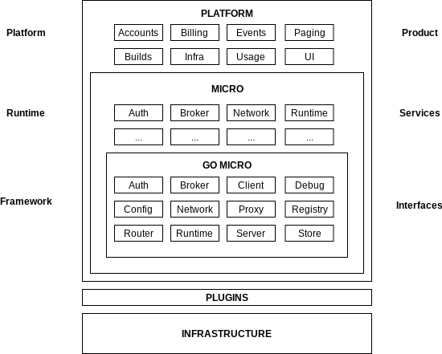

# Architecture

The platform architecture doc describes what the platform is, what its composed of and how its built.

## Overview

The platform serves as a fully managed platform for microservices development. It builds on go-micro 
and the micro runtime to provide **Micro as a Service**. It adds additionally functionality on top for 
infrastructure automation, account management, billing, alerting, etc.

## Features

- **Cloud Automation** - Full terraform automation to bootstrap platform
- **Account Management** - GitHub account management via teams
- **Alerting** - Event notification and alerting via email/sms/slack
- **Billing** - Metered billing of services used
- **Dashboard** - A full UX experience via a web dashboard
- **GitOps** - Source to Running via GitHub actions
- **K8s Native** - Built to run on Kubernetes
- **Multi-Cloud** - Ability to manage and deploy services across multiple clouds and regions
- More soon...

## Design

The platform layers on the existing open source tools and there's a clear separation of concerns. The breakdown 
is as follows:

- Platform - Micro as a Service. Fully managed platform - Hosted product and commercially licensed
- Runtime - [Micro](https://github.com/micro/micro) is a runtime for services - Open source Apache 2.0 licensed
- Framework - [Go Micro](https://github.com/micro/go-micro) is a framework for microservices development - Open source Apache 2.0 licensed

## Diagram

The interaction between these layers is clearly delineated. Every layer builds on the next with only 
one way interaction. Platform => Runtime => Framework.



## Framework

The framework is geared towards developers writing services and primarily focused on Go development. It provides 
abstractions for the underlying infrastructure and is Apache 2.0 licensed as a completely open pluggable standalone 
framework.

## Runtime

The micro runtime builds on the framework to provide service level abstractions for each concern. It provides a 
runtime agnostic layer thats gRPC based so that we can build on it. It's effectively a programmable foundation. 
By using the framework it becomes pluggable and agnostic of infrastructure. The framework should not reference 
the runtime.

## Platform

The platform builds on the runtime. It's a fully managed solution that provides automation to bootstrap the runtime 
and run it across muliple cloud providers and regions globally. Where the runtime focuses on one addressable 
environment, the platform extends into multiple independent environments and namespaces that can be managed in one place.

There is overlap between the runtime and platform but primarily the point of differentation is that Micro serves 
as an open source runtime environment for microservices and the Platform is a commercial product that provides 
**Micro as a Service**. The platform extends the functionality of Micro to include automation, alerting, billing, 
account management, gitops workflow, k8s native deployment and a web dashboard.

## Configuration

The platform acts as configuration of a micro runtime and should do so for all entrypoints including the CLI.

Our `micro` cli is driven by the same config as the rest of the tools. In the case of environment related changes 
this should be driven by a platform plugin or the platform cli binary itself. This is currently a WIP.

Assuming we want to configure the remote environment

```
# will configure a local ~/.micro file interactively
platform init
```

The contents of ~/.micro

```

MICRO_PROXY_ADDRESS=proxy.m3o.com
MICRO_AUTH_TOKEN=eyJ0eXAiOiJKV1QiLCJhbGciOiJIUzI1NiJ9.eyJzdWIiOiIxMjM0NTY3ODkw
...
```

